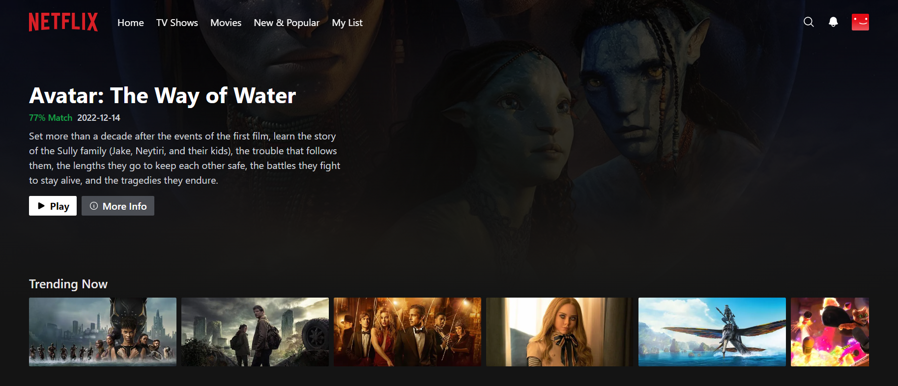

# [Netflx-web](https://netflx-web.vercel.app/)

This project is a Netflix clone bootstrapped with the [create-next-app](https://nextjs.org/docs/api-reference/create-next-app).

[](https://netflx-web.vercel.app/)

## Tech Stack

- [Next.js](https://nextjs.org)
- [Tailwind CSS](https://tailwindcss.com)
- [Firebase](https://firebase.google.com)
- [TMDB API](https://developers.themoviedb.org/3/getting-started/introduction)

## Features

- Authentication with Firebase
- Fetch movies and TV shows from TMDB API
- Show details and trailers of movies and TV shows
- Add movies and TV shows to watchlist

## Installation

### 1. Clone the repository

```bash
git clone https://github.com/sadmann7/netflx-web.git
```

### 2. Install dependencies

```bash
yarn install
```

### 3. Create a `.env` file

Create a `.env` file in the root directory and add the environment variables as shown in the `.env.example` file.

### 4. Run the application

```bash
yarn run dev
```

The application will be available at `http://localhost:3000`.

## Deployment

The easiest way to deploy is to use the [Vercel Platform](https://vercel.com/new?utm_medium=default-template&filter=next.js&utm_source=create-next-app&utm_campaign=create-next-app-readme) from the creators of Next.js.

Check out our [Next.js deployment documentation](https://nextjs.org/docs/deployment) for more details.
